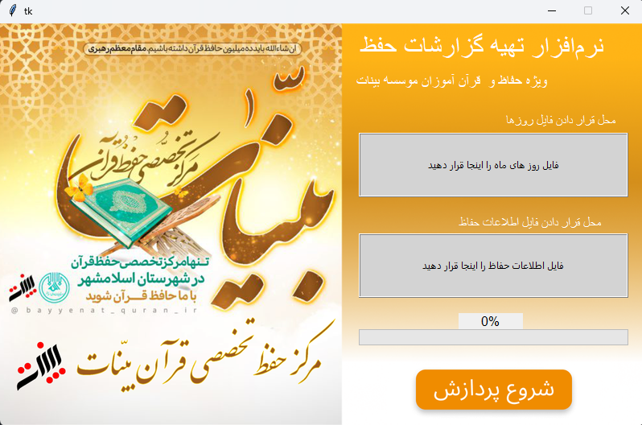

# Bayyenat Report Generator Software

<div align="center">

  <a href="https://www.bayyenatquran.com/">
    
  </a>

  <p>
    <strong>Bayyenat Report Generator Software</strong>
  </p>


</div>

This software uses 2 .docx document files and generate some data based on a template we provided. Those are 2 .xlsx files one for days in a months and the other is students' data, information like their makrs, name, teacher description and so on. The output is some folders based on year and month and in each folder there would be some .docx files that are editable.

With this software, as a teacher, you'll have this power to create hundreds or thousands of reports for your students.


## Install & Test

```bash
pip install -r requirements.txt
```

```bash
python main.py
```
